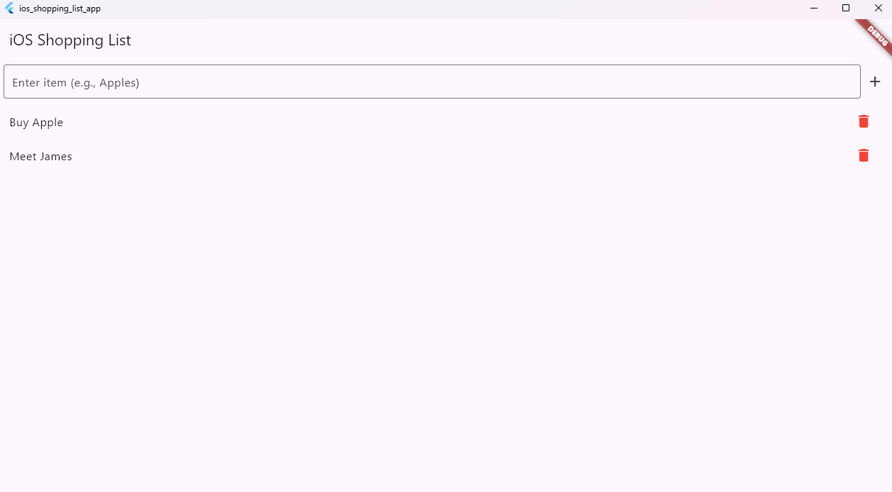

# iOS Shopping List App

A simple iOS-style shopping list app built with Flutter. Users can add, delete, and mark items as bought, with persistent storage using `shared_preferences`.

[](https://opensource.org/licenses/MIT)

## Table of Contents
- [Features](#features)
- [Screenshots](#screenshots)
- [Requirements](#requirements)
- [Setup Instructions](#setup-instructions)
- [Usage](#usage)
- [Project Structure](#project-structure)
- [Contributing](#contributing)
- [License](#license)

## Features
- **Add Items**: Add items (e.g., "Apples") to your shopping list.
- **Delete Items**: Remove items with a single tap.
- **Mark as Bought**: Check off items to strike through them.
- **Persistent Storage**: Save lists between app sessions using shared_preferences.

## Screenshots
| Main Page | Edit Page | Strikethrough Page |
|-------------|-------------|-------------|
|  |  |  |

## Prerequisites
- Flutter SDK: [Install Flutter](https://flutter.dev/docs/get-started/install)
- Android Studio or Visual Studio Code
- Android emulator or physical device

### Installation
1. Clone the repository:
   ```bash
   git clone https://github.com/johnkoshy/iOS-Shopping-List-App.git
2. Navigate to the project directory:
   ```bash
   cd iOS-Shopping-List-App
3. Install dependencies:
   ```bash
   flutter pub get
4. Run the app:
   ```bash
   flutter run

## Usage

1. Launch the app on your emulator or device.
2. Tap the **Add Item** button to enter a new item (e.g., "Apples").
3. Check the box next to an item to mark it as bought (strikes through the text).
4. Tap **Delete** to remove an item from the list.

## Project Structure
- **lib/main.dart**: Entry point of the app.
- **lib/screens/**: Contains UI screens (e.g., main list, edit page).
- **pubspec.yaml**: Defines dependencies, including shared_preferences.
- **screenshots/**: Stores app screenshots.

## Technologies
- **Flutter (Dart)**: Framework for cross-platform UI.
- **shared_preferences**: Package for persistent storage.

## Contributing
Contributions are welcome! Please submit a pull request or open an issue on GitHub for suggestions or bug reports.

## License
This project is licensed under [MIT License](LICENSE).